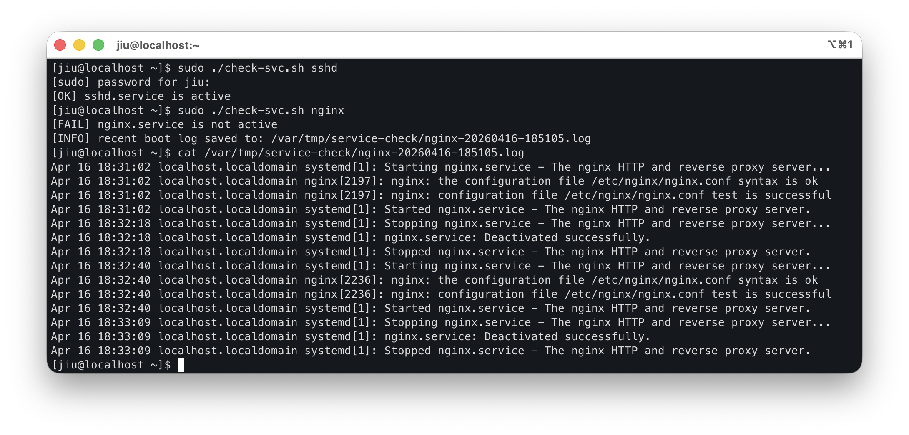

## 운영 자동화 실습
---

### 서비스 헬스체크 + 최근 journal 저장

서비스가 내려가 있으면 최근 부팅 기준 로그를 바로 파일로 저장한다.

```bash
#!/bin/bash
set -u

SERVICE="${1:-sshd}"
OUT_DIR="/var/tmp/service-check"
TS=$(date +"%Y%m%d-%H%M%S")

mkdir -p "$OUT_DIR"

if systemctl is-active --quiet "${SERVICE}.service"; then
    echo "[OK] ${SERVICE}.service is active"
    exit 0
else
    echo "[FAIL] ${SERVICE}.service is not active"

    LOG_FILE="${OUT_DIR}/${SERVICE}-${TS}.log"

    journalctl -u "${SERVICE}.service" -b --no-pager > "$LOG_FILE"

    echo "[INFO] recent boot log saved to: $LOG_FILE"
    exit 1
fi
```




<br>
<br>

## 안전하게 스크립트 작성하기

#### 1. 테스트 환경에서 먼저 실행하기

운영 서버에서 바로 실행하기보다, 테스트용 디렉터리나 샘플 파일로 먼저 동작을 검증하는 것이 좋다.

예를 들어 로그 정리 스크립트라면 실제 `/var/log` 대신  
직접 만든 `./test-logs` 디렉터리에서 먼저 실행해볼 수 있다.

<br>

#### 2. 절대 경로 사용하기

스크립트는 실행 위치에 따라 상대 경로가 달라질 수 있다.  
그래서 중요한 작업일수록 절대 경로를 쓰는 편이 더 안전하다.

예를 들어:

```bash
LOG_FILE="/var/log/app.log"
```

<br>

#### 3. 삭제 명령(`rm`) 주의하기

삭제 명령은 가장 조심해야 한다.  
특히 변수와 함께 사용할 때는 값이 비어 있거나 예상과 다르면 위험해질 수 있다.

예를 들어 아래 같은 명령은 항상 신중해야 한다.

```bash
rm -rf "$TARGET_DIR"
```

삭제 작업을 넣기 전에는 먼저 `echo`, `ls`, `find` 등으로  
**정말 원하는 대상이 맞는지 확인하는 단계**를 거치는 것이 좋다.

<br>

#### 4. root 권한 스크립트 주의하기

`sudo`나 root 권한으로 실행되는 스크립트는 영향 범위가 훨씬 크다.  
파일 삭제, 계정 변경, 패키지 설치 같은 작업은 시스템 전체에 영향을 줄 수 있다.

초기 학습 단계에서는  
가능하면 root 권한이 필요 없는 작업부터 연습하는 것이 안전하다.

