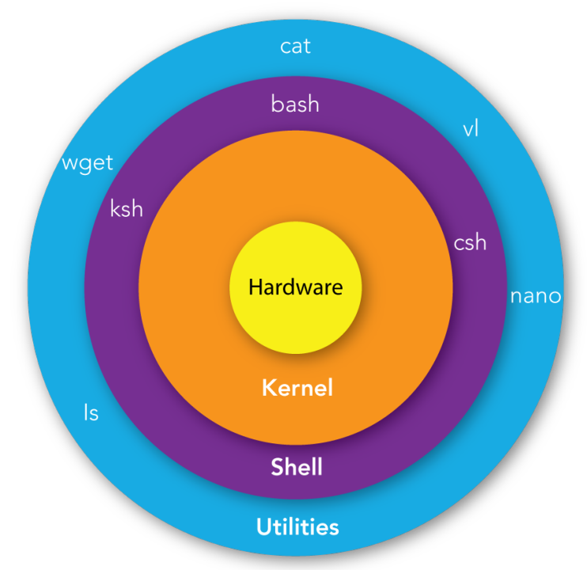
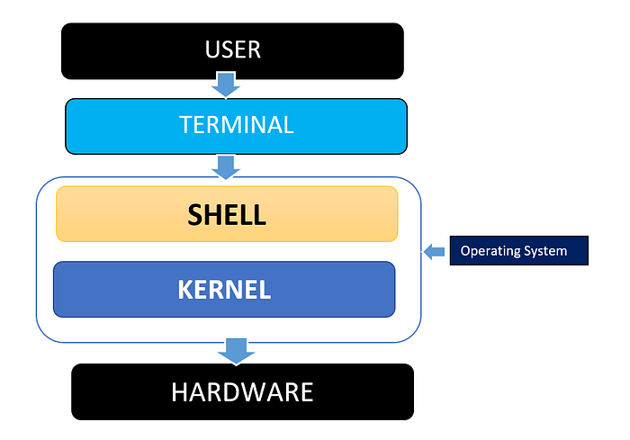
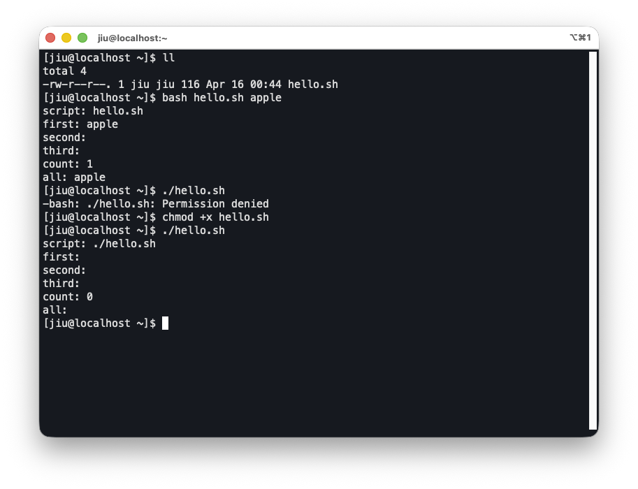
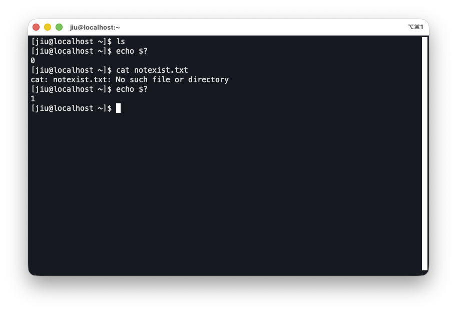
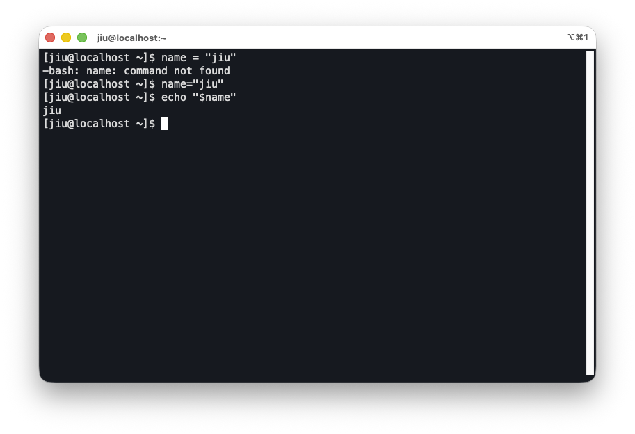
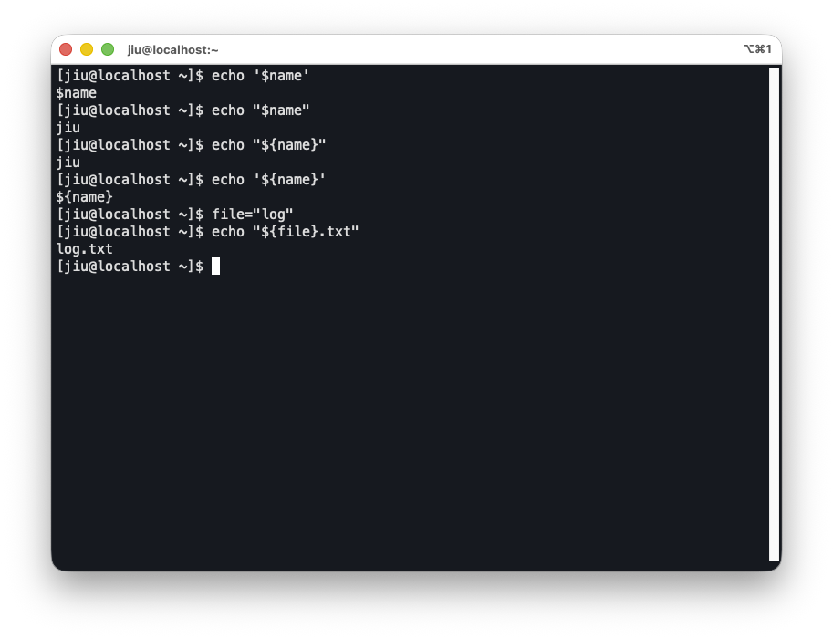
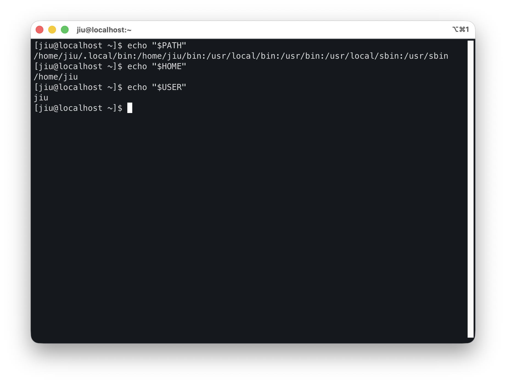
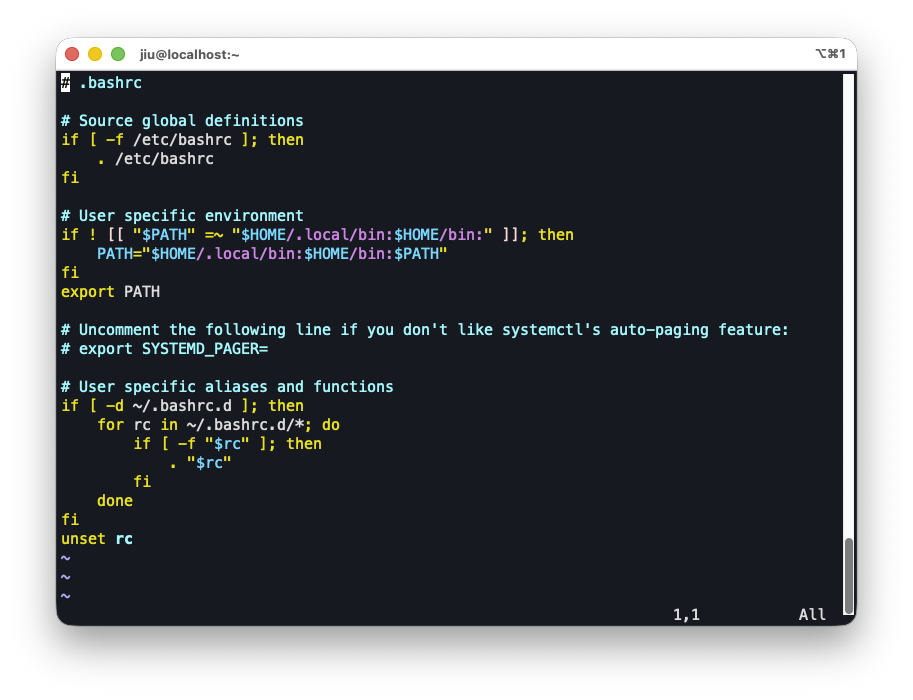
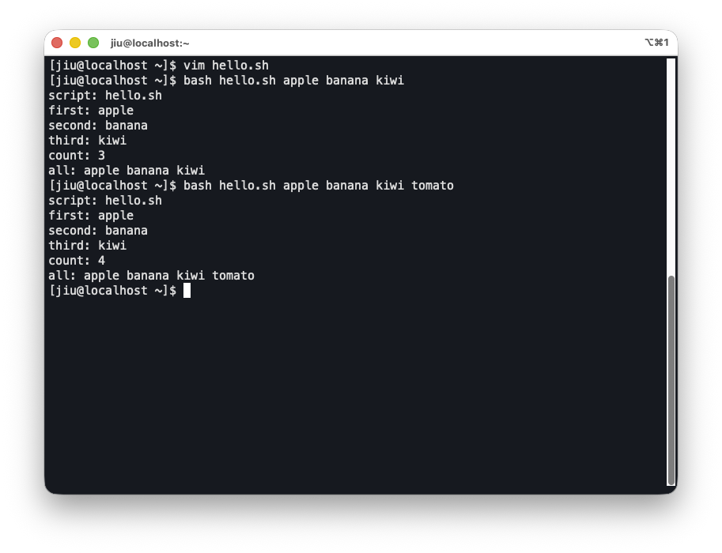

리눅스에서 반복 작업을 자동화하거나 여러 명령을 순서대로 실행하려면 쉘 스크립트를 작성하게 된다.

특히 운영 환경에서는 명령을 한 번 실행하는 것을 넘어,   
일관된 절차를 코드로 남기고 재사용 가능한 형태로 만드는 것이 중요하다.

이 글에서는 Bash 스크립트를 처음 다룰 때 필요한 기본 개념을 다음 흐름으로 정리한다.
- [Shell과 Bash](https://jiu-jung.github.io/rhel-bash-basics/#Shell과-Bash)
- [Bash Script의 기본 구조와 실행](https://jiu-jung.github.io/rhel-bash-basics/#Bash-Script의-기본-구조와-실행)
- [Bash Script의 실행 흐름](https://jiu-jung.github.io/rhel-bash-basics/#Bash-Script의-실행-흐름)
- [변수와 문자열](https://jiu-jung.github.io/rhel-bash-basics/#변수와-문자열)
- [환경 변수와 export](https://jiu-jung.github.io/rhel-bash-basics/#환경변수와-export)
- [명령행 인자](https://jiu-jung.github.io/rhel-bash-basics/#명령행-인자)


<br>

## Shell과 Bash
---

### Shell

<br>





Shell은 사용자가 입력한 명령을 해석해 운영체제에 전달하는 **명령어 인터페이스**다.

사용자는 터미널에서 명령을 입력하고,  
Shell은 그 명령을 해석한 뒤 적절한 프로그램을 실행한다.

이름 그대로 커널을 감싸는 껍데기 역할을 한다고 해서 **Shell**이라고 부른다.

<br>

Shell의 종류

- Bourne Shell (`sh`)
- C Shell (`csh`)
- Z Shell (`zsh`)
- Bourne Again Shell (`bash`)

<br>

> #### 헷갈리기 쉬운 용어    
> - **Shell**: 명령을 해석하고 실행하는 프로그램
> - **Terminal**: Shell을 사용할 수 있게 해주는 화면 환경
> - **Console**: 시스템과 직접 연결된 입력/출력 환경을 가리키는 전통적 표현
> - **Prompt**: 명령 입력을 기다리는 표시 (`$`, `#` 등)


<br>

### Bash
<br>

Bash는 여러 Shell 중 하나이며, 정식 이름은 Bourne Again Shell이다.

리눅스 환경에서 가장 널리 사용되는 Shell 중 하나이며,  
Bourne Shell(`sh`)을 계승하면서 스크립트 작성과 사용자 편의 기능을 강화한 Shell이라고 볼 수 있다.

<br>

Bash는 단순히 명령을 실행하는 것뿐 아니라 다음 기능도 제공한다.

- 변수 사용
- 조건문, 반복문
- 명령 치환
- 스크립트 파일 실행
- 환경 변수 관리

<br>

이러한 기능 덕분에 Bash는  
단순 명령 입력 도구를 넘어 **자동화와 운영 작업을 작성하는 실행 환경**으로도 사용된다.

<br>

### Bash Script
<br>

Bash Script는 **Bash가 읽고 실행할 명령들을 모아 둔 텍스트 파일**이다.  

즉, 사용자가 터미널에 직접 입력할 명령들을 파일로 저장해 반복 실행할 수 있게 만든 형태라고 볼 수 있다.

<br>

주로 다음과 같은 목적에 사용한다.

- 반복 작업 자동화
- 운영 절차 표준화
- 여러 명령의 순차 실행
- 환경 설정 및 배포 보조 작업

<br>

주요 특징은 다음과 같다.
- 텍스트 파일 형태로 작성한다  
- 별도 컴파일 없이 쉘이 읽어서 실행한다  
- 변수, 조건문, 반복문을 사용할 수 있다  
- 운영 자동화와 반복 작업 처리에 적합하다

<br>

예를 들어 여러 명령을 매번 직접 입력하는 대신, 아래처럼 하나의 .sh 파일에 정리해둘 수 있다.     
이렇게 하면 동일한 작업을 반복할 때 사람이 직접 명령을 다시 입력하지 않아도 된다.

```bash
#!/bin/bash
echo "start"
date
echo "done"
```

<br>
<br>

## Bash Script의 기본 구조와 실행
---

### 기본 구조

<br>


기본적인 Bash 스크립트는 아래처럼 시작한다.

```bash
#!/bin/bash

echo "Hello, Bash"
```

<br>

### Shebang

<br>

스크립트의 **첫 줄**에 자주 보이는 아래 구문을 **Shebang**이라고 한다.

```bash
#!/bin/bash
```

이 줄은 운영체제에게 “이 파일은 `/bin/bash`로 실행하라”는 의미를 전달한다.      
즉, Shebang은 스크립트 파일 자체를 실행할 때 어떤 해석기를 사용할지 명시하는 역할이다.

<br>

예를 들어 Python 스크립트라면 이렇게 쓸 수 있다.

```bash
#!/usr/bin/env python3
```

<br>

Bash 스크립트에서는 보통 다음 둘 중 하나를 자주 사용한다.

```bash
#!/bin/bash
```
```bash
#!/usr/bin/env bash
```


<br>

### 실행 방식

<br>

Bash 스크립트는 대표적으로 두 방식으로 실행한다.

#### 1. `bash script.sh`

이 방식은 **Bash 프로그램이 script.sh 파일을 읽어서 실행**하는 형태다.

- 실행 권한이 없어도 동작 가능
- Shebang이 없어도 Bash로 실행 가능


#### 2. `./script.sh`

이 방식은 **파일 자체를 실행**하는 형태다.

- 실행 권한이 있어야 함
	`chmod +x ./script.sh`
- Shebang이 있어야 어떤 인터프리터로 실행할지 명확함

#### 실행 예시


- 실행 권한이 없는 상태에서, `bash script.sh` 방식으로 실행하면 성공하지만,     
    `./script.sh` 방식으로 실행하면 실패한다.
- 스크립트파일에 실행권한을 추가한 뒤에는 `./script.sh` 방식으로도 실행에 성공했다.

<br>
<br>

## Bash Script의 실행 흐름
---
### 명령어 실행과 순차 처리

<br>

Bash 스크립트는 **명령을 위에서 아래로 순서대로 실행한다.**

<br>

한 줄에 명령 하나를 쓰면 그대로 실행된다.

```bash
echo "start"
```

<br>

여러 줄로 작성하면 순서대로 처리된다.

```bash
echo "step 1"
date
echo "step 2"
```

<br>

한 줄에 세미콜론 `;`으로 이어서 쓸 수도 있다.

```bash
echo "step 1"; date; echo "step 2"
```

<br>

### 종료 코드 (Exit Code)

<br>

Shell에서 모든 명령은 실행이 끝난 뒤 **종료 코드(exit code)** 를 남긴다.        
이 값은 명령의 성공 여부를 판단하는 기준이 된다.

종료코드 값의 의미
- `0` → 성공
- `0이 아닌 값` → 실패 또는 예외 상황

<br>

### `$?`로 결과 확인하기
<br>

`$?` 를 통해 **직전에 실행한 명령의 종료 코드**를 확인할 수 있다.

운영 스크립트에서는 이 종료 코드를 바탕으로 다음 동작을 계속할지, 에러 처리할지를 판단하게 된다.

<!-- <br> -->

#### 예시



- 성공한 명령어 `ls` 의 종료 코드는 0
- 실패한 명령어 `cat`의 종료 코드는 1


<br>
<br>

## 변수와 문자열
---

<br>

Bash에서는 값을 변수에 저장해서 재사용할 수 있다.  

### 일반 변수

<br>

일반 변수는 **현재 쉘 안에서만** 사용하는 값이다.

```bash
name="jiu"
echo "$name"
```

<br>

일반 변수를 정의할 때, `=` 양옆에 공백이 없어야 한다.

```bash
name="jiu"   # 정상
name = "jiu" # 오류
```

<br>

변수를 사용할 때는 앞에 `$`를 붙인다.

```bash
echo "$name"
```

<!-- <br> -->

#### 예시

- `=` 양 옆에 공백이 있는 경우, 변수 저장이 되지 않는다.


<br>

### 문자열

<br>


Bash Script에서 문자열은 작은따옴표와 큰따옴표로 표현할 수 있다.

#### 작은따옴표 `' '`

문자열을 **있는 그대로** 취급한다.

```bash
name="jiu"
echo '$name'
```

출력
```bash
$name
```

<br>

#### 큰따옴표 `" "`

변수나 일부 특수 문자가 해석된다.

```bash
name="jiu"
echo "$name"
```

출력
```bash
jiu
```


<br>

### 변수 참조

<br>

변수 앞에 `$`를 붙여 값을 꺼낸다.

```bash
name="jiu"  
echo "$name"
```

<br>

중괄호를 써서 경계를 명확히 할 수도 있다.

```bash
echo "${name}"
```

<br>

중괄호는 변수명과 다른 문자열이 붙을 때 특히 유용하다.

```bash
file="log"  
echo "${file}.txt"
```

<br>

#### 문자열과 변수 참조 예시


- 작은따옴표로 감싼 문자열은 있는 그대로 저장된다.
- 큰따옴표로 감싼 문자열은 변수 해석이 적용된다.
- 중괄호를 써서 변수 경계를 명확히 할 수 있다.

<br>
<br>


## 환경변수와 export
---
### 환경 변수

<br>


환경 변수는 현재 쉘 + 현재 쉘이 실행하는 **자식 프로세스에도 전달되는 변수**다.

```bash
export name="jiu"
```

위처럼 환경변수를 설정하면 이후 실행되는 프로그램도 `name` 값을 참조할 수 있다.

환경 변수는 단순한 저장값이 아니라 **실행 환경의 일부**라고 볼 수 있다.         
그래서 자식에게 상속되는 문맥에 포함되는 것이다.


<br>

### export의 의미

<br>

`export`는 변수를 환경 변수로 내보내는 명령이다.

```bash
name="jiu"
export name

# 한 줄로 쓸 수도 있다.
export name="jiu"
```

#### 예시

- export를 실행하지 않으면 현재 쉘이 생성한 자식 bash 프로세스에서 `$name`을 인식하지 못한다.
- export를 실행하면 현재 쉘이 생성한 자식 bash 프로세스에서 `$name`을 인식한다.

<br>

### export의 유효기간

<br>

`export`한 변수는 현재 쉘과 그 자식 프로세스에서 유효하지만,  
**현재 세션이 끝나면 사라진다**.

즉, 아래 경우에는 더 이상 유지되지 않는다.

- 터미널 세션 종료
- 해당 쉘 종료
- 새로 로그인한 다른 쉘 시작
- 시스템 재부팅 후 새 세션 시작

<br>

### 환경변수 영구적으로 유지하기

<br>

특정 환경변수를 영구적으로 유지하려면       
매번 새 쉘이 시작될 때 다시 설정되도록 **Shell 초기화 파일**에 적어야 한다.

보통 아래 파일 중 하나에 export 문을 넣는다.
- `~/.bashrc`
- `~/.bash_profile`
- `~/.profile`

<br>

실제로 `~/.bashrc` 파일을 보면, PATH 환경변수를 지정하는 export 문이 기본으로 써있다.


<br>

### 자주 보는 환경 변수: `PATH`, `HOME`, `USER`

<br>

운영체제는 여러 기본 환경 변수를 제공한다.

#### `PATH`

**명령어를 찾을 디렉터리 목록**이다.
예를 들어 `ls`라고만 입력해도 실행되는 이유는  
Shell이 알아서 `PATH`에 등록된 디렉터리들에서 `ls` 실행 파일을 찾기 때문이다.

```bash
echo "$PATH"
```


#### `HOME`

현재 사용자의 홈 디렉터리다.
`/home/user` 같은 값이 들어 있다.

```bash
echo "$HOME"
```


#### `USER`

현재 사용자 이름이다.
스크립트 안에서 실행 계정을 확인할 때 자주 사용한다.

```bash
echo "$USER"
```

#### 예시


<br>
<br>

## 명령행 인자
---


### 명령행 인자: `$0`, `$1`, `$2`, `$#`, `$@`

<br>

스크립트를 실행할 때 뒤에 값을 붙이면 그 값들을 스크립트 안에서 참조할 수 있다.     
이를 통해 스크립트를 입력에 따라 다르게 동작하게 할 수 있다.

아래처럼 스크립트 실행 시 인자를 넘겨준다.

```bash
bash hello.sh apple banana
```

<br>

스크립트 내부에서는 다음처럼 접근한다.

- `$0` : 스크립트 이름
- `$1` : 첫 번째 인자
- `$2` : 두 번째 인자
- `$#` : 인자 개수
- `$@` : 전체 인자 목록


#### 예시

`hello.sh`

```bash
#!/bin/bash

echo "script: $0"
echo "first: $1"
echo "second: $2"
echo "third: $3"
echo "count: $#"
echo "all: $@"
```

