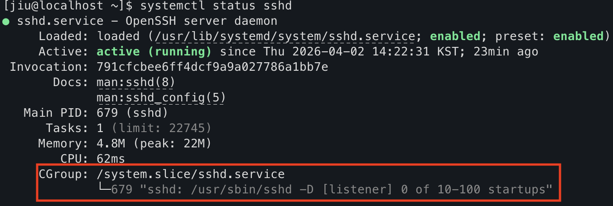
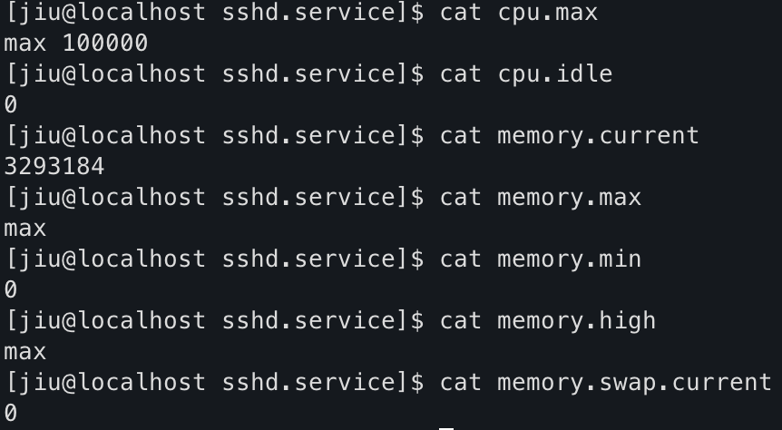

멀티 유저, 멀티 프로세스 운영 환경에서는    
각 서비스가 얼마나 CPU와 메모리를 사용할 수 있는지,  
그리고 하나의 서비스 문제가 다른 서비스까지 번지지 않도록 어떻게 통제할 것인지가 중요하다.

따라서 프로세스를 실행 대상뿐만 아니라, **자원 관리의 대상**으로도 다뤄야 한다.

이 글에서는 Red Hat 리눅스가 자원 통제를 어떻게 수행하는지, 다음 순서로 정리한다.
- [**cgroup**: 자원 관리의 핵심](https://jiu-jung.github.io/rhel-cgroup/#cgroup-자원-관리의-핵심)
- [**systemd**: cgroup의 관리 주체](https://jiu-jung.github.io/rhel-cgroup/#systemd-cgroup의-관리-주체)
- [RHEL에서 보는 cgroup 구조](https://jiu-jung.github.io/rhel-cgroup/#RHEL에서-보는-cgroup-구조)
- [자원 제어의 동작 방식](https://jiu-jung.github.io/rhel-cgroup/#자원-제어의-동작-방식)

<br>


## cgroup: 자원 관리의 핵심
---

### cgroup이란?

<br>

cgroup은 **Control Group**의 약자로,  
- **여러 프로세스**를 하나의 그룹으로 묶고
- **그룹 단위로 자원을 제한하고 추적**하는
- **리눅스 커널 기능**이다.

<br>

예를 들어 다음과 같은 정책을 적용할 수 있다.
- 이 서비스는 메모리를 512MB까지만 사용
- 이 서비스는 CPU를 일정 비율까지만 사용
- 이 서비스는 생성 가능한 프로세스 수를 제한
- 이 서비스의 디스크 I/O를 제한

<br>

> 리눅스는 cgroup이라는 커널 기능을 통해 **프로세스 그룹 단위로 자원을 제어**한다.

<br>

### cgroup이 제공하는 기능

<br>

cgroup은 크게 네 가지 기능을 제공한다.

#### 1. 자원 제한 (Limit)

각 그룹에 사용할 수 있는 자원 한도를 설정할 수 있다.

- CPU 사용량 제한
- 메모리 사용량 제한
- 디스크 I/O 제한
- 프로세스 수 제한

#### 2. 자원 격리 (Isolation)

하나의 서비스가 문제를 일으켜도 
다른 서비스까지 영향을 주지 않도록 분리할 수 있다.

#### 3. 우선순위 제어 (Priority)

특정 서비스에 더 많은 CPU 비중을 주거나, 
덜 중요한 작업의 우선순위를 낮출 수 있다.

#### 4. 사용량 추적 (Accounting)

그룹 단위로 CPU, 메모리, I/O 사용량을 추적할 수 있다.


<br>
<br>


## systemd: cgroup의 관리 주체
---

### systemd와 cgroup의 관계


<br>

현대 리눅스에서 서비스 관리는 **systemd**가 담당한다.

systemd는 다음과 같은 운영 기능을 제공한다.
- 서비스 시작과 종료
- 상태 관리
- 자동 재시작    
- 의존성 관리
- 로그 연계
- **자원 제어**   
이 가운데 **자원 제어**를 실제로 가능하게 해주는 기반이 바로 **cgroup**이다.

<br>

### 서비스별 cgroup 생성과 적용


<br>

systemd는 서비스를 실행할 때,  
- **해당 서비스 전용 cgroup** 을 만들고
- **관련 프로세스를 모두 그 안에 넣는다.**  
- 그 다음 **필요한 자원 정책을 그 cgroup에 적용**한다.

<br>

정리하면 내부 동작은 다음과 같다.

```text
1. 서비스 실행
2. 해당 서비스용 cgroup 생성
3. 관련 프로세스를 그 cgroup에 배치
4. 자원 정책 적용
```

<br>

### systemctl status로 cgroup 확인하기


<br>

`systemctl status`를 보면 다음과 같은 항목이 보인다.



```text
CGroup: /system.slice/sshd.service
```

이 의미는 다음과 같다.

- `sshd.service`에 속한 프로세스들이
- `/system.slice/sshd.service`라는 cgroup 아래 묶여 있고
- 그 단위로 자원 관리가 이루어진다는 뜻이다


<br>
<br>


## RHEL에서 보는 cgroup 구조
---

### cgroup 버전


<br>

RHEL에서는 cgroup 버전에 따라 구조가 다르다.

cgroup v1에서는 리소스별로 CPU, 메모리, I/O 등이 각각 별도의 계층으로 나뉘어,  
**CPU용 트리와 메모리용 트리가 따로** 존재했다.

반면 cgroup v2는 **모든 자원을 하나의 트리에서 통합 관리**한다.


이 구조는 다음 장점이 있다.
- 구조가 단순함
- systemd와의 통합이 쉬움
- 자원 관리 방식이 일관됨

RHEL 9 이상에서는 cgroup v2 구조가 기본이다.

<br>


### cgroup 기본 경로


<br>

```bash
/sys/fs/cgroup/
```
cgroup v2의 기본 경로는 위와 같다.    
이 아래에서 systemd가 관리하는 서비스와 자원 구조를 확인할 수 있다.

<br>


### systemd가 관리하는 cgroup 단위

<br>

cgroup 기본 경로 아래에는 systemd가 만든 단위들이 계층적으로 나타난다.    
주요 단위는 다음과 같다.

#### 1. slice

slice는 systemd가 만든 **상위 논리 그룹**이다.    
자원 분배의 큰 틀을 나누는 단위라고 볼 수 있다.    
예를 들어 `system.slice` 아래에 있다는 것은 해당 unit이 시스템 서비스 영역에 속한다는 뜻이다.

#### 2. service

service는 실제 서비스 단위이다.  
보통 systemd의 service unit과 1:1로 대응한다.   
예: `sshd.service`, `nginx.service`

#### 3. scope

scope는 서비스 외부에서 시작된 프로세스를 systemd 관리 범위 안에 포함시킬 때 사용하는 단위다.

<br>

정리하면 다음과 같다.

> - **slice**: 상위 그룹
> - **service**: 실제 서비스 단위
> - **scope**: 외부 프로세스 관리 단위    

<br>


### cgroup controller 파일


<br>

실제 자원 제한과 사용량 확인은 **controller 파일**을 통해 이루어진다.

cgroup 디렉터리 안에는 자원 제한과 상태 확인에 사용하는 controller 파일들이 있다.  
이 파일들이 **실제 자원 제어 인터페이스** 역할을 한다.

대표적인 controller는 다음과 같다.

|controller|역할|
|---|---|
|`cpu`|CPU 사용량 제어|
|`memory`|메모리 제한 및 사용량 확인|
|`io`|디스크 I/O 제어|
|`pids`|프로세스 수 제한|

<br>

예를 들어 다음 경로를 보자.

```bash
/sys/fs/cgroup/system.slice/sshd.service/
```

이 안에는 다음과 같은 파일이 있을 수 있다.

- `cpu.max`
    
- `memory.max`
    
- `memory.current`
    
- `pids.max`
    

이 파일들의 의미는 다음과 같다.

- `*.max` : 어디까지 허용할 것인가
    
- `*.current` : 지금 얼마나 쓰고 있는가
    

<br>

실제로 출력해보면 아래처럼 값이 나타난다.



<br>
<br>

## 자원 제어의 동작 방식
---

### systemd 설정이 cgroup으로 반영되는 방식

<br>

운영자는 보통 cgroup 파일을 직접 수정하기보다, **systemd 설정을 통해 자원 정책을 적용**한다.  

예를 들어 **unit file**에 다음과 같이 설정할 수 있다.

```ini
[Service]
CPUQuota=20%
MemoryMax=512M
```
이 설정은 내부적으로 cgroup 관련 값으로 반영된다.

예를 들어 다음과 같은 controller 파일과 연결된다.

- `cpu.max`
- `memory.max`

<br>

> 운영자가 **unit file**을 통해 자원 정책을 설정하면    
> **systemd**가 **controller 파일**에 매핑하여 구현한다.

<br>


### 실행 중 자원 정책 변경


<br>

cgroup 기반 자원 정책은 실행 중에도 변경할 수 있다.
다음 두가지 방식으로 자원 정책을 변경할 수 있다.

#### 1. systemd 방식

```bash
systemctl set-property nginx.service CPUQuota=30%
```

이 명령은 서비스 재시작 없이 자원 정책을 즉시 적용한다.

#### 2. low-level
```bash
echo "30000 100000" > cpu.max
```
이처럼 group 파일을 직접 수정할 수도 있다.    
다만 실제 운영에서는 직접 파일을 수정하기보다, systemd를 통해 관리하는 것이 더 안전하고 일관적이다.

<br>


## 정리
---

<br>

- 리눅스에서 자원 관리는 프로세스 그룹 단위로 이루어진다.
- **cgroup**은 프로세스를 그룹 단위로 묶어 자원을 제어하는 커널 기능이다.
- **systemd**는 서비스를 실행할 때 해당 서비스용 cgroup을 만들고 자원 정책을 적용한다.
- cgroup 디렉터리의 **controller** 파일들을 통해 실제 제한과 사용량 확인이 이루어진다.
- 운영자가 **unit file**을 통해 자원 정책을 설정하면 **systemd**가 **controller 파일**에 매핑하여 구현한다.
