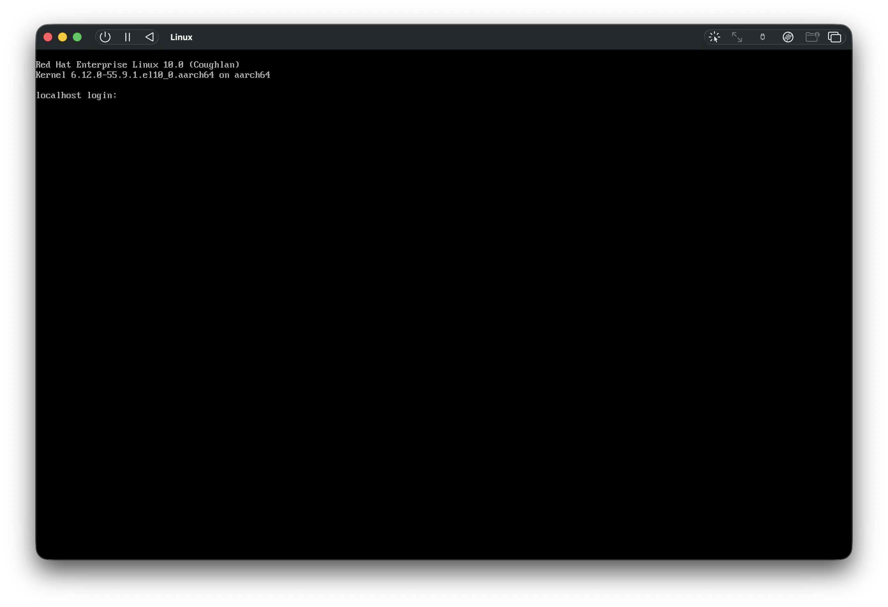

엔터프라이즈 환경의 리눅스를 실습해보고 싶어서, **UTM**을 이용해 **RHEL 10** 가상머신을 설치했다.

이번 글에서는 아래 순서로 설치 과정을 정리한다.
1. [환경 세팅 (UTM VM 생성)](https://jiu-jung.github.io/rhel-installation/#1-환경-세팅)
2. [RHEL 설치 및 초기 설정](https://jiu-jung.github.io/rhel-installation/#2-RHEL-설치-및-초기-설정)
3. [Red Hat 구독 등록](https://jiu-jung.github.io/rhel-installation/#3-구독-등록)

<br>

## 0. 설치 환경
---

- MacBook pro M5 (10 코어, 24GB 메모리, 512GB 스토리지)
- UTM
- RHEL 10 (`rhel-10.0-aarch64-dvd.iso`)

<br>

## 1. 환경 세팅
---

#### 1) UTM 설치

먼저 [UTM 다운로드 페이지](https://mac.getutm.app/)에서 UTM을 설치한다.

> UTM은 macOS에서 다른 운영체제를 손쉽게 설치하고 실행할 수 있도록 도와주는 가상머신 도구이다.

<br>

#### 2) RHEL 이미지 다운로드

RHEL 이미지는 [Red Hat Developers](https://developers.redhat.com/)에 가입한 뒤 [공식 다운로드 페이지](https://developers.redhat.com/products/rhel/download#publicandprivatecloudreadyrhelimages)에서 받을 수 있다.

아래 이미지를 다운받았다.
- `rhel-10.0-aarch64-dvd.iso`

>  M 시리즈 맥에서는 `aarch64` 이미지를 선택해야 한다.

<br>

#### 3) UTM에서 VM 생성

UTM을 실행한 뒤 아래 순서대로 가상머신을 만든다.

    Create a New Virtual Machine → Virtualize → Linux

옵션은 다음과 같이 설정했다.

**Memory**
- `4096 MiB`
- `Enable display output` 체크
- `Enable hardware OpenGL acceleration` 체크 해제

**Linux**
- `Use Apple Virtualization` 체크 해제
- `Boot from ISO image` 선택
- `Boot ISO Image`에 다운로드한 `rhel-10.0-aarch64-dvd.iso` 선택

**Storage**
- `64 GiB`

**Shared Directory**
- `Share is read only` 체크 해제

**Summary**
- `Save`

> 가볍게 실습할 목적이라 4GB 메모리, 64GB 스토리지로 설정했다.

기본적인 VM 생성이 끝났다.

<br>

## 2. RHEL 설치 및 초기 설정
---

설치 과정은 잘 정리된 [블로그](https://velog.io/@calintzcs/%EC%84%A4%EC%B9%98-Red-Hat-Enterprise-Linux-8.x-Minimal-%EC%84%A4%EC%B9%98LegacyUEFI)를 참고하여 진행했다.

#### 1) 설치 시작

부팅 후 설치 메뉴가 뜨면 다음 항목으로 들어간다.
- `Install Red Hat Enterprise Linux 10.0`

<br>


#### 2) Software Selection

- `Minimal Install` 선택

> 필요한 것만 직접 추가하면서 환경을 구성해보기 위해 `Minimal Install`을 선택했다.

<br>


#### 3) Installation Destination

- `Storage Configuration`에서 `Custom` 선택

> 파티션 구성을 직접 확인해보기 위해 `Custom`으로 진행했다.

<br>


#### 4) Manual Partitioning

- `New mount points will use the following partitioning scheme`  
    → `Standard Partition` 선택
- `Click here to create them automatically` 클릭
- 기본값 그대로 두고 `Done`

<br>


#### 5) Network & Host Name

- `Configure` 클릭
- `General` 탭
    - `Connect automatically with priority` 값은 `-999` 유지
    - 자동 연결 체크 유지
- `IPv4 Settings`
    - `DHCP` 유지

> 별도로 고정 IP를 지정해야 하는 환경이 아니라면 기본 DHCP 설정으로 충분하다.

<br>


#### 6) Root Account

- `Enable root account` 체크
- root 비밀번호 지정

> 학습용 환경이라 root 계정을 바로 활성화해두었다.
> 실제 운영 환경이라면 root 직접 사용보다 일반 사용자 + sudo 방식이 더 권장된다.

<br>


#### 7) 설치 완료 및 재부팅

- 설치 완료 후 `Reboot System` 선택

> 설치에는 약 1분 정도 소요되었다.

<br>

#### 8) 설치 성공!

위처럼 터미널 창이 나오면 설치가 제대로 된 것이다. 로그인을 진행하면 된다.

<br>

## 2*. 트러블슈팅
---

#### 1) display output is not active

처음에는 display output 설정이 잘못된 줄 알고 UTM 설정을 여러 번 수정했다.  
그런데 실제로는 오류가 아니라, **몇 초 기다리면 정상적으로 설치 화면이 나타났다.**

> `display output is not active` 문구가 보이면 기다리면 된다!

<br>


#### 2) 재부팅 후 다시 설치 화면이 뜨는 문제

설치가 끝난 뒤 재부팅했는데, 다시 RHEL 설치 화면으로 들어가는 문제가 있었다.

이 문제의 원인은 **UTM이 계속 ISO 파일로 부팅**하고 있기 때문이다.
- UTM에서는 설치용 ISO가 removable drive처럼 연결된 상태로 남아 있다.
- 따라서 설치가 끝난 뒤에도 VM이 가상 디스크가 아니라 설치용 ISO를 다시 먼저 읽어서, installer 화면으로 돌아가게 된다.

**해결 방법**

- 사이드바에서 해당 VM 우클릭
- `Edit` → `Drives` → `USB Drive`
- `Path`에 연결된 ISO 경로를 `Clear`
- `Save`

<br>


## 3. 구독 등록
---

RHEL은 패키지 설치와 업데이트를 위해 Red Hat 계정 구독 등록이 필요하다.

터미널에서 아래 명령어를 실행해서 계정 정보를 입력하면 된다.
```bash
subscription-manager register
```

RHEL 10.0 환경에서는 위 명령어만으로 별도 추가 설정 없이 등록이 완료되었다.

이후에는 아래 명령어로 시스템 정보와 구독 상태를 확인하고, 패키지를 업데이트했다.

```bash
# 시스템 정보 확인
cat /etc/redhat-release

# 구독 상태 확인
subscription-manager status

# 패키지 메타데이터 갱신 및 업데이트
dnf check-update  
sudo dnf update -y
```
