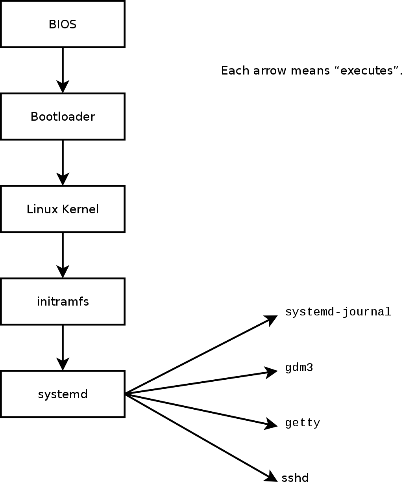

리눅스에서 실행되는 모든 프로그램은 **프로세스** 단위로 관리된다.  
프로세스는 **PID, 부모-자식 관계, 실행 상태, 자원 사용 정보**를 포함한 운영체제의 관리 대상이다.

이 글에서는 아래 흐름으로 리눅스 프로세스의 구조와 제어를 정리한다.
- [어떻게 처음 시작되는가 — **PID 1**](https://jiu-jung.github.io/rhel-process/#프로세스의-시작-PID-1)
- [어떤 구조로 연결되는가 — **프로세스 트리**](https://jiu-jung.github.io/rhel-process/#프로세스-트리)
- [어떻게 생성되고 실행되는가 — **`fork`, `exec`**](https://jiu-jung.github.io/rhel-process/#프로세스-생성-및-실행)
- [어떻게 관찰하고 제어하는가 — **`ps`, `top`, `kill`, `nice`, `renice`**](https://jiu-jung.github.io/rhel-process/#프로세스-관찰-및-제어)

<br>

## 프로세스의 시작: PID 1
---

먼저 **시스템이 부팅된 뒤 어떤 프로세스가 처음 실행되는지** 를 살펴보자.

커널은 사용자 프로그램들을 하나씩 직접 실행하지 않는다. 

대신 **사용자 공간의 첫 프로세스 하나를 실행**하고, 이후의 서비스와 세션 관리는 그 프로세스가 맡는다. 이 첫 프로세스가 바로 **PID 1** 이다.

<br>


### 1) 부팅 이후 실행 흐름

<!--  -->

1. **펌웨어(BIOS/UEFI)** 가 하드웨어를 초기화
2. **부트로더(GRUB 등)** 가 리눅스 커널을 메모리에 적재
3. **커널(kernel)** 이 메모리, CPU, 장치 드라이버, 파일시스템 등을 초기화
4. 커널이 사용자 공간의 첫 프로세스를 실행
5. 이 첫 프로세스가 이후 나머지 서비스와 세션을 시작

 > 커널은 직접 모든 사용자 프로그램을 실행하지 않고, **사용자 공간의 시작점이 되는 PID 1을 먼저 실행한다**

<br>


### 2) PID 1의 역할

PID 1은 이후 사용자 공간 전체의 기준점이 된다.

- 모든 사용자 공간 프로세스의 **최상위 부모**
- 서비스 시작 및 관리
- orphan 프로세스 수용

> 리눅스에서 모든 프로세스는 **PID 1에서 시작된 흐름 위에 존재한다**

<br>


### 3) `init`과 `systemd`

이 **PID 1 역할**을 전통적으로는 **`init`** 이 맡았고, 현대 리눅스에서는 대부분 **`systemd`** 가 맡는다.

둘 다 사용자 공간의 첫 프로세스라는 점은 같지만, **시스템을 관리하는 방식에는 차이**가 있다.

<br>


#### 왜 init에서 systemd로 넘어갔나

전통적인 `init`은 현대 시스템을 운영하기에는 다음과 같은 한계가 있었다.
- 서비스들을 **순차적으로 실행**해서 부팅이 느릴 수 있음
- 서비스 간 **의존성 관리**가 어려움
- 로그, 타이머, 소켓 같은 운영 기능이 분리되어 있음


반면 `systemd`는 현대 시스템 환경에 맞게 다음을 제공한다.
- **의존성 기반 실행**
- **병렬 부팅**
- **서비스/로그/타이머의 통합 관리**

> `init`은 “서비스를 **순서대로** 띄우는 시작점”에 가까웠다면
> `systemd`는 **서비스들을 관계 기반으로 관리하는 운영 체계**에 더 가깝다.


<br>


## 프로세스 트리
---

PID 1 이후 만들어지는 프로세스들은
- 서로 독립적으로 떠 있는 것이 아니라 
- **부모-자식 관계를 가지는 트리 구조**를 이룬다.  

따라서 프로세스의 계층적 구조를 이해해야
- 프로세스는 **누가 만들었는가**를 보면 동작을 이해할 수 있다
- 장애 분석 시 **원인 추적**이 가능하다
- 종료나 재시작 시 **영향 범위**를 판단할 수 있다

> 리눅스에서 프로세스를 볼 때 **어떤 프로세스가 누구에 의해 생성되었는지**를 함께 볼 수 있어야 한다.

<br>

### 1) 특징

- 모든 프로세스는 **PID** 를 가짐
- 대부분의 프로세스는 **PPID(Parent PID)** 를 가짐
- 새로운 프로세스는 기존 프로세스가 생성
- 최상위 기준점은 PID 1 (`systemd`)

> 어떤 프로세스든 위로 따라 올라가면 결국 PID 1에서 시작된 흐름에 연결된다.

<br>


### 2) 상속

자식 프로세스는 **부모가 가진 실행 문맥을 이어받은 상태에서 시작한다**.

예를 들어, 다음과 같은 것들을 상속받는다.
- 환경 변수
- 현재 작업 디렉터리
- 파일 디스크립터
- 사용자/권한 정보
- 일부 리소스 제한값

상속 덕분에 셸에서 환경 변수를 `export` 한 뒤 명령어를 실행하면 그 명령어가 실행된 프로세스도 같은 환경을 사용할 수 있다.

<br>

### 3) orphan과 zombie 프로세스

프로세스 트리에는 다음의 예외적인 상태가 있다.

#### orphan process

- 부모 프로세스가 먼저 종료되어 **고아가 된 자식 프로세스**
- 자식은 보통 PID 1(`systemd`)가 수용한다
- 부모가 죽어도 자식이 바로 사라지는 것은 아니다

#### zombie process
- 자식 프로세스는 이미 종료되었지만, 부모가 종료 상태를 아직 회수(`wait`)하지 않아 프로세스 테이블에 남아 있는 상태
- 실제 실행 중은 아니며, 부모가 `wait()` 하면 정리된다

> orphan은 **살아 있는 자식이 부모를 잃은 상태**이고,  
> zombie는 **이미 종료된 자식의 상태가 아직 회수되지 않은 상태**다.

<br>


## 프로세스 생성 및 실행
---

프로세스 트리는 **기존 프로세스가 새로운 프로세스를 만들면서** 형성된다.
리눅스에서는 이 과정을 보통 **`fork()` 와 `exec()`** 로 설명한다.

- **`fork()`**: 새 프로세스를 만든다
- **`exec()`**: 그 프로세스를 다른 프로그램으로 바꾼다

> 즉리눅스에서 새 프로그램 실행은 보통 **프로세스 생성**과 **프로그램 교체**가 이어지는 흐름으로 이루어진다.

<br>


### 1) `fork()`: 프로세스 생성

`fork()` 는 현재 프로세스를 복제하여 **자식 프로세스**를 만든다.

```c
pid = fork();
```

`fork()` 가 호출되면, 부모와 자식은 거의 동일한 상태에서 각각 실행을 이어간다.  

**반환값**
- 부모 프로세스: 자식의 PID 반환
- 자식 프로세스: `0` 반환
- 실패 시: `-1`

부모와 자식은 같은 코드에서 시작하지만, 반환값이 다르기 때문에 이후 서로 다른 동작을 하도록 분기할 수 있다.

<br>


### 2) `exec()`: 프로그램 교체

`exec()` 계열 함수는 현재 프로세스의 메모리 공간을 **새 프로그램으로 덮어쓴다**.

```c
exec("/bin/ls", ...);
```
`exec()` 는 새 프로세스를 만들지 않고, 이미 존재하는 프로세스를 **다른 프로그램으로 교체**한다.

- 기존 PID 유지
- 기존 프로세스 자리에 새 프로그램이 올라감
- 성공하면 원래 코드로 돌아오지 않음


<br>

### 3) 왜 `fork()` 와 `exec()` 를 나눴을까

두 과정이 분리되어 있어서 **프로세스를 실행하기 전에 필요한 준비**를 먼저 할 수 있다.

예를 들면 자식 프로세스에서 `exec()` 전에 다음과 같은 작업이 가능하다.
- 표준 입력/출력 리다이렉션
- 파일 디스크립터 정리
- 환경 변수 설정
- 권한 변경

즉 **실행 환경을 먼저 준비한 뒤 원하는 프로그램으로 교체할 수 있기 때문에** `fork()` 와 `exec()` 가 나뉘어 있다.

<br>

### 4) Shell에서 명령어 실행 흐름

터미널에서 `ls` 를 입력하면 개념적으로 다음과 같이 동작한다. *(실제 구현에서는 `clone`이나 `posix_spawn` 같은 최적화가 사용된다)*

	bash → fork → exec(ls)

- `bash` 가 자식 프로세스를 하나 만든다
- 자식 프로세스가 `exec()` 를 호출해 `ls` 프로그램으로 바뀐다
- 부모 셸은 자식이 끝날 때까지 기다리거나, 상황에 따라 백그라운드로 넘긴다

Shell에서 명령어를 실행하는 것은 **기존 프로세스가 새 프로세스를 만들고, 그 프로세스가 다시 원하는 프로그램으로 바뀌는 과정**이다.

<br>


## 프로세스 관찰 및 제어
---
이제 실행 중인 프로세스를 어떻게 확인하고, 상태를 바꾸고, 자원 사용을 조정할 것인지 알아보자.
리눅스에서 프로세스 제어는 크게 세 가지로 나뉜다.
- **조회**: `ps`, `top`
- **상태 변경**: `kill`
- **자원 사용 제어(우선순위)**: `nice`, `renice`

<br>


### 1) `ps`: 현재 프로세스 조회
*ps: process status의 약자*

현재 시점의 프로세스 상태를 **정적인 스냅샷**으로 보여준다.

```bash
ps
```
<br>

**자주 쓰는 옵션**
- `a`: 다른 사용자 프로세스도 포함
- `u`: 사용자 중심 포맷
- `x`: 터미널 없는 프로세스도 포함
- `e`: 환경 변수까지 함께 표시
- `f`: 부모-자식 관계를 포함한 full format 표시

<br>

**자주 쓰는 형태**
```bash
# 가장 많이 쓰이는 형태
ps aux

# 시스템 전체 프로세스를 계층/관계 중심으로 보기 좋다.
ps -ef

# 특정 PID만 조회
ps -p <PID>

# 프로세스 트리 형태로 보기  
ps -ef --forest
```

<br>


### 2) `top`: 실시간 프로세스 모니터링

시스템의 CPU, 메모리, 로드 평균, 프로세스 상태를 **실시간으로 갱신**해서 보여준다.

```bash
top
```

<br>


**확인하는 것**
- CPU 사용률
- 메모리 사용량
- load average
- 어떤 프로세스가 자원을 많이 먹는지
- 프로세스 상태 (`R`, `S`, `D`, `Z` 등)

<br>


**자주 쓰는 형태**
```bash
# 특정 PID만 집중 모니터링
top -p <PID>

# 특정 사용자의 프로세스만 보기
top -u <user_name>

# 갱신 주기 지정
top -d <second>

# 전체 커맨드라인 표시
top -c
```

<br>


**실행 중 자주 쓰는 키**
- `P`: CPU 사용량 기준 정렬
- `M`: 메모리 사용량 기준 정렬
- `k`: 프로세스 종료 신호 보내기
- `r`: nice 값 변경
- `1`: CPU 코어별 보기
- `q`: 종료

<br>


### 3) `kill`: 프로세스에 제어 시그널 전달

프로세스를 종료하는 명령어가 아니라, **프로세스에 시그널을 보내는 명령어**다.

<br>


**자주 쓰는 형태**

```bash
# 기본 종료 요청 - SIGTERM(15)
kill <PID>

# SIGTERM 명시
kill -TERM <PID>

# 재시작 없이 설정 재로드 용도로 자주 사용
kill -HUP <PID>

# 시그널 목록 확인
kill -l
```

<br>


**자주 쓰는 시그널**

| 시그널            | 의미            | 용도         |     |
| -------------- | ------------- | ---------- | --- |
| `SIGTERM (15)` | 정상 종료 요청      | 가장 먼저 시도   |     |
| `SIGKILL (9)`  | 강제 종료         | 최후 수단      |     |
| `SIGINT (2)`   | 인터럽트          | Ctrl+C 유사  |     |
| `SIGHUP (1)`   | hangup/reload | 설정 재적용 용도  |     |
| `SIGSTOP`      | 일시 정지         | 즉시 멈춤      |     |
| `SIGCONT`      | 재개            | 중단 후 다시 실행 |     |

<br>


**운영 주의사항**
- 무조건 `kill -9` 부터 쓰지 않는다
- 먼저 `SIGTERM` 으로 정상 종료를 시도한다
- 종료가 안 될 때만 `SIGKILL` 고려한다.
- 서비스라면 `kill` 보다 `systemctl stop/restart` 가 우선이다

<br>


### 4) `nice` / `renice`: CPU 우선순위 조정

리눅스 스케줄러는 모든 프로세스에 동일하게 CPU를 주지 않는다.  
각 프로세스는 우선순위를 가지며, 사용자는 `nice` 값을 통해 이를 조정할 수 있다.

<br>


**기본 규칙**
- 값 범위: **-20 ~ 19**
- 숫자가 **낮을수록 우선순위 높음**
- 숫자가 **높을수록 우선순위 낮음**

<br>


`nice`: 새 프로세스를 특정 우선순위로 시작

```bash
nice -n 10 python app.py
```

<br>


`renice`: 이미 실행 중인 프로세스의 우선순위 변경

```bash
renice -n 5 -p 1234
```

<br>


## 정리
---

다음 네가지는 꼭 기억하자!

1. 모든 프로세스는 **PID 1에서 시작된다**
2. 프로세스는 **트리 구조로 연결된다**
3. 실행은 `fork → exec`으로 이루어진다
4. 운영자는 이를 **조회(ps/top)하고 제어(kill/nice)** 한다