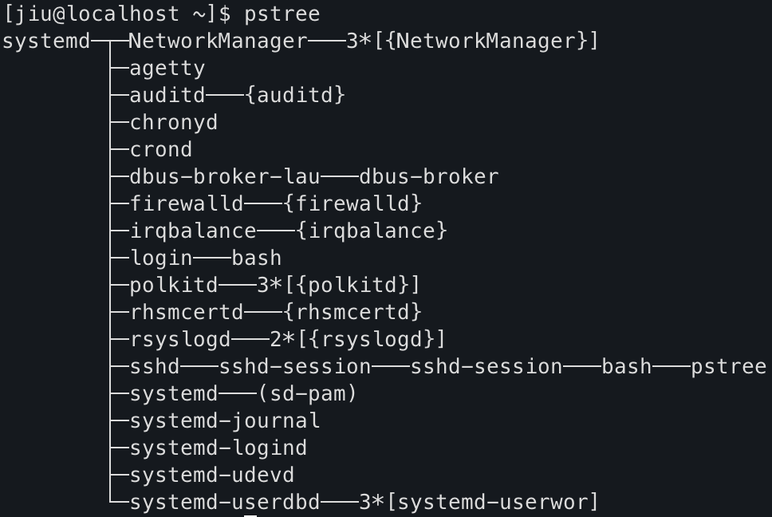
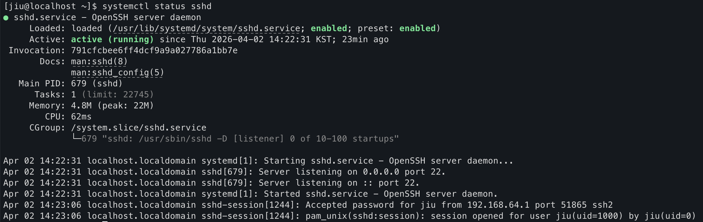
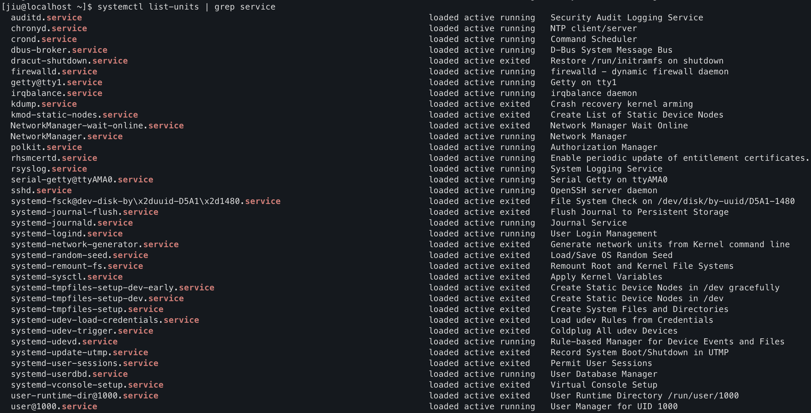
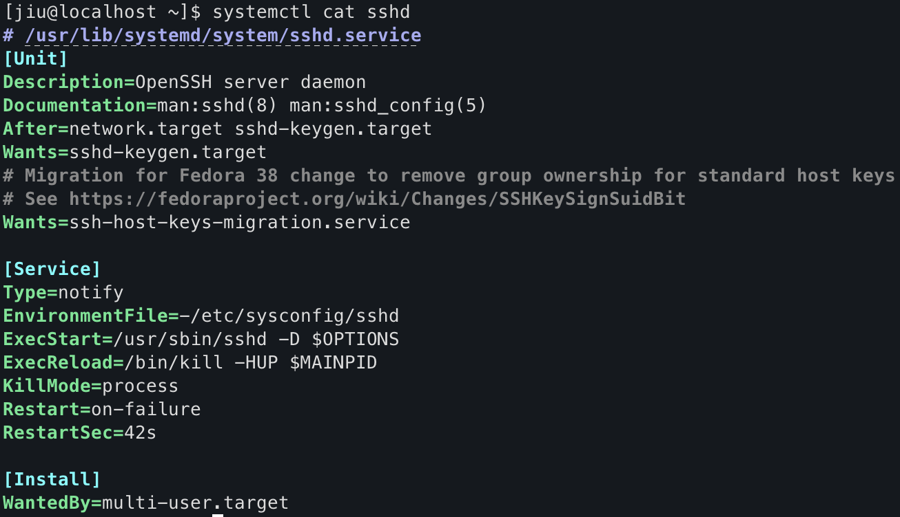

리눅스 운영 환경에서는 단순히 **프로세스가 실행 중인가**만 보는 것으로는 충분하지 않다.
실제로 운영에서는 **서비스가 정상적으로 관리되고 있는가**를 기준으로 시스템을 바라보게 된다.

예를 들어 어떤 프로그램이 죽었을 때, 단순 프로세스라면 종료된 것으로 끝나지만, 서비스로 관리되고 있다면 자동으로 다시 시작될 수 있다. 또 부팅 시 자동 실행, 권한 분리, 환경 변수 주입, 로그 확인까지 모두 서비스 단위에서 관리된다.

이 글에서는 리눅스 서비스 운영의 핵심 개념인 다음 네 가지를 운영 관점에서 정리한다.
- [서비스: 리눅스 운영의 중심](https://jiu-jung.github.io/rhel-service/#서비스-리눅스-운영의-중심)
- [`systemd`: 서비스 관리의 중심](https://jiu-jung.github.io/rhel-service/#systemd-리눅스-서비스-관리의-중심)
- [`systemctl`: 서비스 제어 인터페이스](https://jiu-jung.github.io/rhel-service/#systemctl-서비스-제어-인터페이스)
- [`unit file`: 서비스 운영 정책 문서](https://jiu-jung.github.io/rhel-service/#Unit-File-서비스-운영-정책-문서)

<br>

## 서비스: 리눅스 운영의 중심
---

> **리눅스 운영은 프로세스가 아니라 서비스 단위로 제어한다.**

#### 1) 프로세스와 서비스는 무엇이 다를까
리눅스를 처음 배울 때는 보통 프로세스의 개념과 관리 방법을 먼저 배운다.  
운영 관점에서는 여기서 한 단계 더 나아가 **서비스**라는 관리 단위를 이해해야 한다.

<br>

#### 2) 프로세스 vs 서비스

| 구분    | 프로세스 (Process) | 서비스 (Service) |
| ----- | -------------- | ------------- |
| 정의    | 실행 중인 프로그램     | 운영 단위         |
| 생명주기  | 죽으면 끝          | 재시작 가능        |
| 관리 방식 | `kill`, `ps`   | `systemctl`   |
| 운영 관점 | 개별 실행 단위       | 정책 기반 관리 단위   |

- 프로세스는 **실행 상태**이고,
- 서비스는 **운영 정책을 포함한 단위**이다.

<br>

#### 3) 서비스
따라서 서비스는 단순히 프로그램을 띄우는 개념이 아니다. 보통 아래와 같은 운영 요소를 함께 포함한다.

- 자동 재시작
- 로그 관리
- 부팅 시 자동 실행
- 실행 계정 및 권한 설정
- 환경 변수 주입

즉, **서비스는 리눅스에서 프로세스를 더 안정적이고 일관되게 운영하기 위해 사용하는 관리 단위**라고 볼 수 있다.

<br>

## `systemd`: 리눅스 서비스 관리의 중심
---

> **systemd**는 현대 리눅스 배포판에서 서비스 관리를 담당하는 표준 시스템이다.


#### 1) systemd의 역할

`systemd`는 시스템 전반의 실행 흐름을 관리하는 중심 역할을 맡는다.

주요 역할은 다음과 같다.

- PID 1, **시스템에서 가장 먼저 시작되는 프로세스**
- 다른 프로세스들의 부모 프로세스
- 서비스 실행 및 상태 관리
- 부팅 과정 제어
- 로그 관리 (`journalctl`)

특히 PID 1이라는 점이 중요하다.  
리눅스에서 **시스템이 부팅되면 가장 먼저 시작되는 프로세스가 `systemd`** 이고, 이후 여러 서비스와 데몬이 이 흐름 아래에서 관리된다.

실제로 `pstree` 명령어를 쳐보면, 대부분의 프로세스의 부모 프로세스가 systemd 인것을 확인할 수 있다.



<br>

#### 2) systemd의 특징

- Red Hat 계열에서 도입되었고, 현재는 Ubuntu를 포함한 대부분의 주요 리눅스 배포판에서 사용된다.
- 운영 중인 서비스의 상태를 판단할 때 사실상 기준점 역할을 한다.

> **운영 현장에서는 systemd를 기준으로 이 서비스가 살아있는지를 확인**한다.

<br>

## `systemctl`: 서비스 제어 인터페이스
---
> `systemctl`은 **`systemd`를 제어하기 위한 CLI 도구**이다.  


#### 1) 주요 명령어

```bash
# 상태 확인
systemctl status <service>

# 시작 / 중지
systemctl start <service>
systemctl stop <service>

# 재시작
systemctl restart <service>

# 부팅 시 자동 실행
systemctl enable <service>
systemctl disable <service>
```

<br>


#### 2) `systemctl status`



이 출력에서 특히 중요하게 봐야 하는 항목은 세 가지다.

1. **`Active`**
현재 서비스 상태를 보여준다.
- `active (running)`: 정상 실행 중
- `failed`: 실패 상태
- `inactive`: 실행 중이 아님
서비스가 죽었는지, 살아 있는지를 가장 먼저 판단하는 기준이다.

1. **`Main PID`**
실제로 이 서비스를 대표해서 실행 중인 프로세스의 PID다.  
운영 중 프로세스 트리나 리소스 사용량을 볼 때 연결점이 된다.

2. **최근 로그**
`status` 하단에는 최근 로그 몇 줄이 같이 붙는 경우가 많다.  
이 부분이 장애 원인을 빠르게 추정하는 데 상당히 유용하다.

> `status`를 통해 **현재 상태 + 실패 힌트**를 함께 확인할 수 있다.

<br>


## Unit File: 서비스 운영 정책 문서
---
> `Unit File`은 서비스가 어떤 운영 정책 아래 움직이는지를 판단할 수 있는 문서이다.


#### 1) Unit
`systemd`를 이해하려면 **Unit** 개념도 알아야 한다.
**Unit은 `systemd`가 관리하는 시스템 구성 요소**를 의미한다.  
서비스뿐 아니라 마운트 지점, 소켓, 타겟 등도 모두 Unit으로 표현된다.

즉, `systemd`는 단순히 서비스만 관리하는 것이 아니라, 시스템 자원과 동작 단위를 **유닛(Unit)** 이라는 공통 개념으로 관리한다.

`systemctl list-units` 명령어를 통해 모든 유닛들을 조회할 수 있다. 그중 서비스 유닛만을 출력해봤다.



<br>

#### 2) Unit File: 서비스의 실행 정의

“everything is a file” 이라는 말처럼,
`systemd`에서도 **서비스 운영 정책이 파일 형태로 정의**된다.
그 파일이 바로 **Unit File**이다.

실무에서는 아예 새 unit file을 처음부터 만드는 일보다,  
**기존 서비스의 unit file을 읽고 해석하거나 일부 수정**하는 일이 더 자주 생긴다.

따라서 unit file을 통해 이 서비스가 어떤 운영 정책 아래 움직이는지를 판단할 수 있어야 한다.

<br>

#### 3) Unit의 종류

|유닛 유형|확장자|설명|
|---|---|---|
|`service`|`.service`|시스템 서비스, 보통 데몬|
|`device`|`.device`|커널이 인식한 디바이스|
|`mount`|`.mount`|파일 시스템 마운트 지점|
|`path`|`.path`|파일 또는 디렉터리 경로 감시|
|`socket`|`.socket`|프로세스 간 통신에 사용하는 소켓|
|`snapshot`|`.snapshot`|저장된 시스템 상태|
|`target`|`.target`|여러 unit을 묶는 논리적 그룹|

<br>

#### 4) Unit File의 위치

Unit file은 보통 다음 디렉토리들에서 관리된다.

|디렉토리|설명|
|---|---|
|`/usr/lib/systemd/system/`|패키지 설치 시 함께 제공되는 기본 unit file|
|`/run/systemd/system/`|런타임에 생성되는 임시 unit file|
|`/etc/systemd/system/`|운영자가 override 하거나 enable 설정에 의해 반영되는 영역. 우선순위가 가장 높다|

운영 관점에서는 `/etc/systemd/system/`이 특히 중요하다.  
기본 설정 위에 운영자 의도가 덮어씌워지는 위치이기 때문이다.

<br>

#### 5) Unit File 구조 읽기

unit file은 보통 세 개의 블록으로 나뉜다.

```ini
[Unit]
Description=My Service
After=network.target

[Service]
ExecStart=/usr/bin/my-app
WorkingDirectory=/app
User=appuser
Environment=ENV=prod
Restart=always

[Install]
WantedBy=multi-user.target
```

각 블록의 역할은 다음과 같다.

**`[Unit]`**
- 서비스의 메타 정보와 의존성을 정의한다.

**`[Service]`**
- 가장 중요한 블록으로, 실제로 **어떻게 실행할 것인가**가 정의된다.
- 핵심 항목
	- `ExecStart`: 실제 실행 명령
	- `WorkingDirectory`: 실행 위치
	- `User` / `Group`: 실행 계정
	- `Environment` / `EnvironmentFile`: 환경 변수 주입
	- `Restart`: 재시작 정책
- 운영자가 이 블록에서 반드시 파악해야 하는 것은 보통 다음 세 가지다.
	- **어떤 명령으로 실행되는가**
	- **어떤 계정으로 실행되는가**
	- **죽었을 때 어떤 정책으로 다시 뜨는가**

**`[Install]`**
- 이 서비스가 enable 되었을 때 어느 target에 연결될지를 정의한다.  
- 쉽게 말해 **부팅 시 자동 시작 설정과 연결**되는 영역이다.

<br>

#### 6) Unit File 확인 방법

1. 서비스의 unit file 보기
```bash
systemctl cat <service>
```

 2. 로드된 unit 위치 확인하기

```bash
systemctl status <service>
```
출력 중 `Loaded` 항목을 보면 어느 파일이 현재 로드되었는지 알 수 있다.

예:
```ini
Loaded: loaded (/usr/lib/systemd/system/sshd.service; enabled; preset: enabled)
```
이 줄은 현재 `sshd.service`가 어느 위치에서 로드되었는지 보여준다.

<br>

#### 7) 실제 예시로 보는 `sshd` Unit File



- `ExecStart=/usr/sbin/sshd -D $OPTIONS`  
    → 실제로 어떤 명령으로 SSH 데몬이 실행되는지 알 수 있다.
- `EnvironmentFile=-/etc/sysconfig/sshd`  
    → 별도 환경 파일을 통해 옵션이 주입될 수 있음을 알 수 있다.
- `Restart=on-failure`  
    → 실패 시 자동 재시작 정책이 걸려 있음을 알 수 있다.


<br>

#### 8) Unit File 수정 후 꼭 해야 하는 작업

unit file을 수정한 뒤에는 아래 명령이 필요하다.

```bash
systemctl daemon-reload
systemctl restart <service>
```

이유는 다음과 같다.

- `systemd`는 unit file을 읽어 내부적으로 로드해 둔다.
- 따라서 파일만 수정하고 끝내면 변경 내용이 바로 반영되지 않을 수 있다.

따라서 아래 두 단계가 함께 가는 경우가 많다.
- `daemon-reload`: 설정 다시 읽기
- `restart`: 실제 서비스 재기동


<br>

## 왜 `kill` 했는데 프로세스가 다시 뜰까?
---

운영하다 보면 프로세스를 죽였는데 다시 살아나는 상황을 자주 겪는다.

이 글을 통해 **리눅스 운영의 중심이 프로세스가 아니라 서비스**라는 점을 이해했다면, 그 원인도 자연스럽게 파악할 수 있을 것이다.
해당 프로세스가 `systemd`에 의해 서비스로 관리되고 있어서, 프로세스를 종료해도 서비스 정책에 따라 다시 실행된 것이다.

그래서 실무에서는 장애가 났다고 해서 바로  `kill`하는 것이 아니라, 먼저 어떤 서비스가 이 프로세스를 관리하고 있는지 확인한 뒤 `systemd`를 통해 조치한다.
보통은 아래와 같은 흐름으로 대응한다.

```
1. status 확인
2. 로그 확인
3. restart로 복구 시도
```

> 결국 리눅스 운영에서는 프로세스 하나가 아니라, 그 **프로세스를 관리하는 서비스 단위로 시스템을 이해**하는 것이 중요하다.