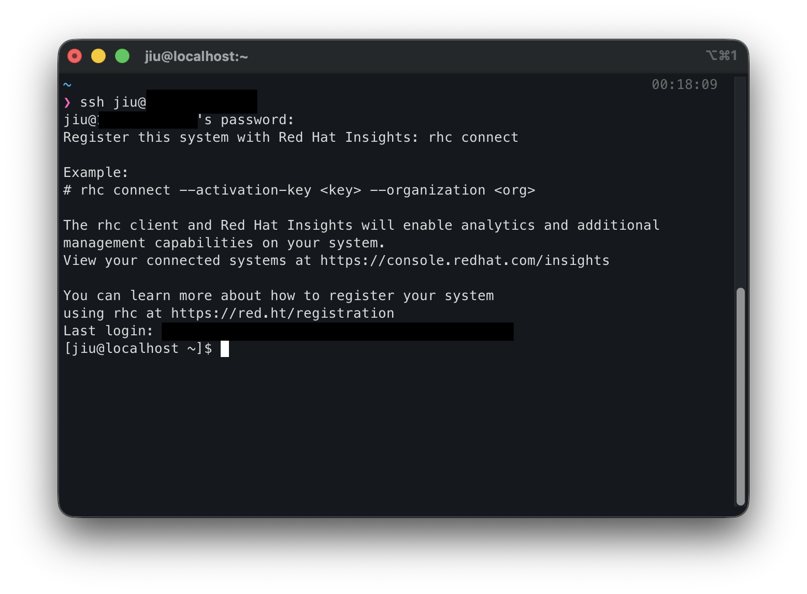

RHEL 10을 **Minimal Install**로 설치한 뒤 CLI 환경에서 실습을 시작했는데,  
터미널 스크롤이 되지 않아 이전 출력 내용을 확인하기가 불편했다.

그래서 **VM 안에 SSH 서버를 설치하고, macOS의 iTerm으로 접속해서 작업하는 방식**으로 환경을 바꿨다.

이번 글에서는 그 설정 과정을 순서대로 정리한다.

1. [일반 사용자 생성](https://jiu-jung.github.io/rhel-ssh/#1-일반-사용자-생성)
2. [SSH 서버 설치 및 실행](https://jiu-jung.github.io/rhel-ssh/#2-SSH-서버-설치-및-실행)
3. [방화벽 상태 확인](https://jiu-jung.github.io/rhel-ssh/#3-방화벽-상태-확인)
4. [VM IP 주소 확인](https://jiu-jung.github.io/rhel-ssh/#4-VM-IP-주소-확인)
5. [iTerm에서 SSH 접속](https://jiu-jung.github.io/rhel-ssh/#5-iTerm에서-SSH-접속)

<br>


### 1. 일반 사용자 생성
---

SSH 접속을 위한 사용자를 생성한다.

```bash
sudo useradd -m <user_name>
sudo passwd <user_name>
sudo usermod -aG wheel <user_name>
```

각 명령어의 의미는 다음과 같다.

- `useradd -m <user_name>` : `<user_name>` 사용자를 생성하고 홈 디렉터리도 함께 만든다.
- `passwd <user_name>` : `<user_name>` 사용자의 비밀번호를 설정한다.
- `usermod -aG wheel <user_name>` : `<user_name>` 사용자를 `wheel` 그룹에 추가한다.

> **`wheel` 그룹** 
>
> RHEL 계열에서는 보통 `wheel` 그룹 사용자에게 `sudo` 권한을 부여하므로, 이후 `<user_name>` 계정으로 로그인하더라도 필요할 때 관리자 권한 명령을 실행할 수 있다.

<br>

### 2. SSH 서버 설치 및 실행
---

VM 내부에 SSH 서버를 설치하고 바로 실행한다.

```bash
sudo dnf install -y openssh-server
sudo systemctl enable --now sshd
sudo systemctl status sshd
```

- `dnf install -y openssh-server` : SSH 서버 패키지 설치
- `systemctl enable --now sshd` : 부팅 시 자동 시작 + 지금 바로 실행
- `systemctl status sshd` : 서비스 상태 확인

`sshd`가 `active (running)` 상태로 보이면 정상적으로 실행된 것이다.

<br>

### 3. 방화벽 상태 확인
---

```bash
sudo systemctl status firewalld
sudo firewall-cmd --permanent --add-service=ssh
```

`ssh` 서비스가 이미 허용되어 있어서 `already enabled`가 출력되었다.

<br>

### 4. VM IP 주소 확인
---

SSH로 접속하려면 VM의 IP 주소가 필요하다. 
아래 명령어로 현재 IP를 확인한다.

```bash
ip addr
```

출력 결과에서 네트워크 인터페이스에 붙은 `inet` 주소를 확인하면 된다.  
이 IP가 나중에 iTerm에서 접속할 때 사용할 주소이다.

<br>

### 5. iTerm에서 SSH 접속
---

이제 macOS에서 iTerm을 열고 아래처럼 접속한다.

```bash
ssh <user_name>@<vm_ip>
```

처음 접속할 때는 fingerprint 확인 메시지가 뜰 수 있는데, `yes`를 입력하면 된다.  
이후 비밀번호를 입력하면 VM의 RHEL 환경에 SSH로 접속된다.

<br>

**접속 성공!**


<br>


### 이후 접속 방법
---

1.  UTM에서 VM 실행
2. VM이 부팅될 때까지 기다리기
	- 로그인 화면이나 셸 프롬프트가 뜰 때까지 기다린다.
	- `sudo systemctl enable --now sshd`를 실행해두었다면, 부팅 시 `sshd`도 자동으로 함께 시작된다.
3. UTM 콘솔에서 상태 확인
	```bash
	systemctl status sshd  
	ip addr
	```
	- `sshd`가 `active (running)` 인지 확인
	- 현재 VM IP가 무엇인지 확인
4. iTerm에서 접속
	```bash
	ssh <user_name>@<vm_ip>
	```

<br>


###  명령어 정리
---

VM 내부에서 실행한 명령어

```bash
sudo useradd -m <user_name>
sudo passwd <user_name>
sudo usermod -aG wheel <user_name>

sudo dnf install -y openssh-server
sudo systemctl enable --now sshd
sudo systemctl status sshd

sudo systemctl status firewalld
sudo firewall-cmd --permanent --add-service=ssh

ip addr
```

iTerm에서 실행한 명령어
```bash
ssh <user_name>@<vm_ip>
```